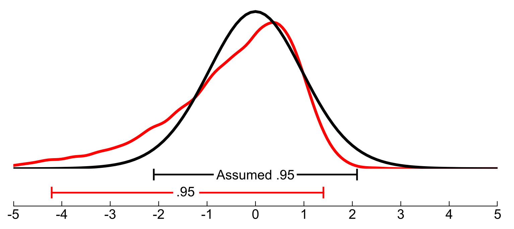

# Hypothesize: robust statistics in Python

Hypothesize is a robust statistics library for 
Python based on Rand R. Wilcox's R package [WRS](https://dornsife.usc.edu/labs/rwilcox/software/). 
With Hypothesize you can compare groups and 
measure associations using methods that outperform 
traditional statistical approaches in terms of power 
and accuracy. 

For more information on robust methods please see Wilcox's book 
[Introduction to Robust Estimation and Hypothesis Testing](https://play.google.com/store/books/details?id=8f8nBb4__EYC&gl=ca&hl=en-CA&source=productsearch&utm_source=HA_Desktop_US&utm_medium=SEM&utm_campaign=PLA&pcampaignid=MKTAD0930BO1&gclid=CjwKCAiA44LzBRB-EiwA-jJipJzyqx9kwNMq5MMU7fG2RrwBK9F7sirX4pfhS8wO7k9Uz_Sqf2P28BoCYzcQAvD_BwE&gclsrc=aw.ds).

## Getting Started

- [Overview](overview.md)
- [Installation](install_dep.md)
- [Basic Tutorial](basic_tutorial.md#)

## User Guide

- [Function reference](function_guide.md)
- [Frequently asked questions](FAQ.md)

## Bug reports and Questions
Hypothesize is BSD-licenced and the source code is available
on [GitHub](https://github.com/Alcampopiano/hypothesize).
For issues and questions, 
please use [GitHub Issues](https://github.com/Alcampopiano/hypothesize/issues).

## Contributing to Hypothesize

Please see [CONTRIBUTING.md](https://github.com/Alcampopiano/hypothesize/blob/master/CONTRIBUTING.md) 
in the GitHub repository for instructions. 