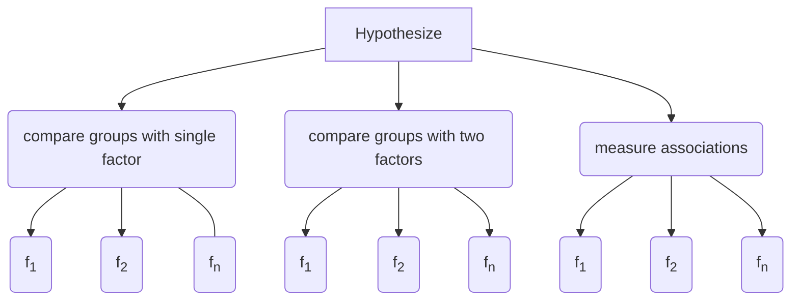

# Overview

The benefits of using robust methods for hypothesis testing 
have been known for the last half century. 
They have been shown to substantially increase power and accuracy when compared to 
traditional approaches.
The issues of robustness and the functions in this library are described in detail in Rand R. Wilcox's book 
[Introduction to Robust Estimation and Hypothesis Testing](https://play.google.com/store/books/details?id=8f8nBb4__EYC&gl=ca&hl=en-CA&source=productsearch&utm_source=HA_Desktop_US&utm_medium=SEM&utm_campaign=PLA&pcampaignid=MKTAD0930BO1&gclid=CjwKCAiA44LzBRB-EiwA-jJipJzyqx9kwNMq5MMU7fG2RrwBK9F7sirX4pfhS8wO7k9Uz_Sqf2P28BoCYzcQAvD_BwE&gclsrc=aw.ds).

The code and function names in Hypothesize are based on Wilcox's R functions in the [WRS](somwhere) package. 
Hypothesize simply brings many of these helpful and well-studied robust methods to the Python ecosystem. 
In addition, Hypothesize provides a user-friendly API and package structure 
as well as one-click, [ready-to-run examples](function_guide.md) for every top-level 
function.

## Hypothesize is easy to use

Hypothesize's API is friendly and 
consistent, making it easy for you to discover 
and use robust functions that are appropriate for 
your statistical design.

### Package Structure

Hypothesize organizes functions
based on the statistical design. The following visualizations show
how the package is structured and how
this is reflected in practice when importing from the library:

	
---

---
## Hypothesize is flexible and powerful

A broad range of choices exist in Hypothesize both in
terms of the supported statistical designs as well as options for fine-grained control over how
tests are computed. For example:

- Where applicable, many hypothesis tests allow the specification of an estimator. That is,
users may choose when to use the mean, median, trimmed mean, winsorized correlation,
percentage bend correlation, or any other compatible statistical estimator.

- Single- and multi-factor designs are supported, and this includes supporting independent,
dependent, and mixed groups.

- Family-wise error can be robustly controlled with sequentially rejective methods (Benjamini & Hochberg, 1995; Hochberg, 1988; Rom, 1990).

 

Visit the [tutorial section](basic_tutorial.md) and the 
[function documentation](function_guide.md) for complete examples
using Hypothesize.