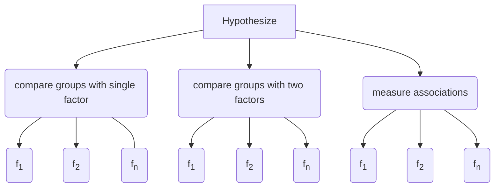

# Overview

The benefits of using robust methods for hypothesis testing 
have been known for the last half century. 
They have been shown to subtantially increase power and accuracy when compared to 
traditional approaches.
The issues of robustness and the functions in this library are described in detail in Rand R. Wilcox's book 
[Introduction to Robust Estimation and Hypothesis Testing](https://play.google.com/store/books/details?id=8f8nBb4__EYC&gl=ca&hl=en-CA&source=productsearch&utm_source=HA_Desktop_US&utm_medium=SEM&utm_campaign=PLA&pcampaignid=MKTAD0930BO1&gclid=CjwKCAiA44LzBRB-EiwA-jJipJzyqx9kwNMq5MMU7fG2RrwBK9F7sirX4pfhS8wO7k9Uz_Sqf2P28BoCYzcQAvD_BwE&gclsrc=aw.ds).

The code and function names in Hypothesize are based on Wilcox's R functions in the [WRS](somwhere) package. 
Hypothesize simply brings many of these helpful and well-studied robust methods to the Python ecosystem. 
In addition, Hypothesize provides a user-friendly API and package structure 
as well as one-click, [ready-to-run examples](somewhere) for every top-level 
function.

## The Hypothesize API

Hypothesize's API is friendly and 
consistent, making it easy for you to discover 
and use robust functions that are appropriate for your statistical design.

### Package Structure

Hypothesize uses its package stucture to organize functions
based on the statistical design. The following flow chart 
and GIF show how Hypothesize organizes its functions and how
this is reflected in practice when importing from the library:


	
<br>


<br>

### Input Parameters

After importing the desired function, 
Hypothesize requires the necessary input arguments. 
For example,
the following statistical test only requires the number of J and K levels, 
and the data to be specified (i.e., the parameter `x`):

```python
from hypothesize.compare_groups_with_two_factors import bwmcp

results=bwmcp(J=2, K=3, x=df)
```
 
Depending on the statistical test, 
Hypothesize allows you to specify optional parameters to control the following (not an exhaustive list):

- The estimator. For example: 
    - trimmed mean
    - winsorized correlation
    - percentage bend correlation
    - mean
    - median
    
    !!! warning "For group comparisons, so far the trimmed mean may be the only supported robust estimator"

- parameters specific to the chosen estimator
(e.g., proportion to trim/winsorize, bending constant, etc)
- options for controlling FWE
- options for how to compute group differences (e.g., marginal, pairwise, all combinations of differences)
- number of bootstrap samples
- contrast matrix to specify linear contrasts
- alpha level
- random seed (for reprodicible results when using bootstrap-based tests)

<br>

Visit the [tutorial section](basic_tutorial.md) and the 
[function documentation](function_guide.md) for complete examples
using Hypothesize.