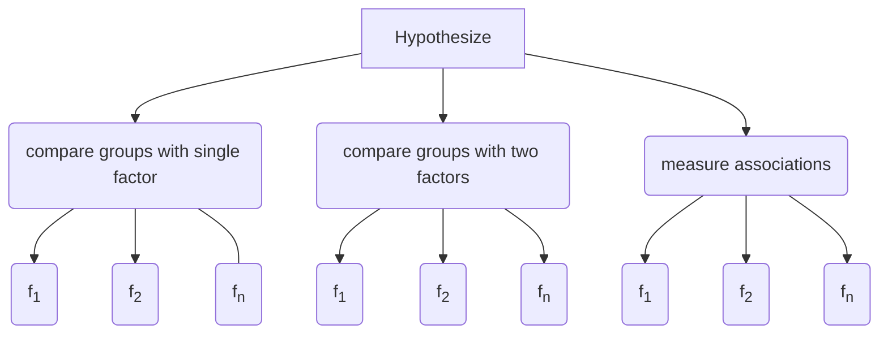

# Overview

The benefits of using robust methods for hypothesis testing 
have been known for the last half century. 
They have been shown to subtatially increase power and accuracy when compared to 
traditional approaches.
The issues of robustness and the functions in this library are described in detail in Rand R. Wilcox's book 
[Introduction to Robust Estimation and Hypothesis Testing](https://play.google.com/store/books/details?id=8f8nBb4__EYC&gl=ca&hl=en-CA&source=productsearch&utm_source=HA_Desktop_US&utm_medium=SEM&utm_campaign=PLA&pcampaignid=MKTAD0930BO1&gclid=CjwKCAiA44LzBRB-EiwA-jJipJzyqx9kwNMq5MMU7fG2RrwBK9F7sirX4pfhS8wO7k9Uz_Sqf2P28BoCYzcQAvD_BwE&gclsrc=aw.ds).

## The Hypothesize API

Hypothesize's API is friendly and 
consistent, making it easy for you to discover 
and use robust functions that are appropriate for your statistical design.

### Package structure

Hypothesize uses it's package stucture to guide you to the 
appropriate function based on your statistical design. The following simplified
chart shows how Hypothesize organizes its functions:



This is hierarcy is reflected in the autocomplete as follows:
	
<br>


<br>

### Getting your data into Hypothesize

In Hypothesize, input data are always specified as a Pandas DataFrame or Series. 
For example, if you have a 2x3 factorial design, your data would take the form of 
a six-column DataFrame (i.e., J levels x K levels). Using Pandas you can read your data into Python and 
use one of the appropriate functions from Hypothesize as follows:

!!! note ""What about my column names", you ask?"
    Don't worry, Hypothesize doesn't make use of your column names. 
    Feel free to name them however you like!


```python
import pandas as pd

df=pd.read_csv('my_data.csv')

df.head() 
```

|    | cell_1_1   |   cell_1_2 |   cell_1_3 |   cell_2_1 |   cell_2_2 |   cell_2_3 |
|----|------------|------------|------------|------------|------------|------------|
|  0 |  0.04      |   0.90     |   0.79     |  0.51      |   0.33     |  0.23      |
|  1 |  0.76      |   0.29     |   0.84     |  0.03      |   0.5      |  0.73      |
|  2 |  0.71      |   0.59     |   0.11     |  0.89      |   0.76     |  0.04      |
|  3 |  0.17      |   0.26     |   0.88     |  0.28      |   0.1      |  0.21      |
|  4 |  0.95      |   0.22     |   0.83     |  0.59      |   0.65     |  0.20      |
    
```python
from hypothesize.compare_groups_with_two_factors import bwmcp

results=bwmcp(J=2, K=3, x=df)
```

The results are returned as a Python Dictionary containing simple Python objects
 or DataFrames (when the results are best given as a matrix). For example, here are the 
 previously computed results for the interaction returned as a DataFrame.

```python
results['factor_AB']
```
    
|    |   con_num |     psihat |       se |      test |   crit_value |   p_value |
|--- |---------- |----------- |--------- |---------- |------------- |---------- |
|  0 |         0 | -0.100698  | 0.126135 | -0.798336 |       2.3771 |  0.410684 |
|  1 |         1 | -0.037972  | 0.151841 | -0.250078 |       2.3771 |  0.804674 |
|  2 |         2 |  0.0627261 | 0.135392 |  0.463291 |       2.3771 |  0.659432 |

<br>

<a class="btn btn-info btn-lg btn-block" 
href="https://colab.research.google.com/github/Alcampopiano/hypothesize/blob/master/examples/hypothesize_notebook_for_colab.ipynb" 
target="_blank">Try this example yourself in Colab!</a>
